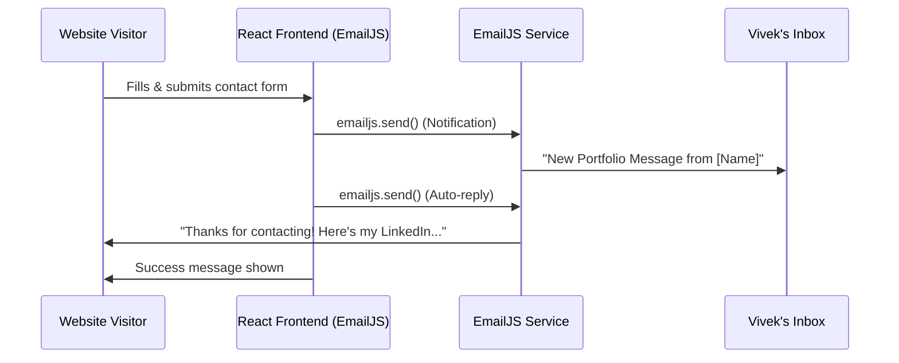

<div align="center">


<br/>


<br/><br/>

[](https://git.io/typing-svg)

<br/>

[](https://react.dev/)
[](https://www.typescriptlang.org/)
[](https://vitejs.dev/)
[](https://tailwindcss.com/)
[](https://www.framer.com/motion/)
[](https://nodejs.org/)
[](https://expressjs.com/)
[](https://threejs.org/)

<br/>

[](https://github.com/VivekChaurasiya95/Portfolio/stargazers)
[](https://github.com/VivekChaurasiya95/Portfolio/network)
[](https://github.com/VivekChaurasiya95/Portfolio/commits/main)

</div>

---

<div align="center">

## Quick Links

[](https://github.com/VivekChaurasiya95/Portfolio)
[](https://www.linkedin.com/in/vivek-chaurasiya-722037315)
[](https://github.com/VivekChaurasiya95)
[](mailto:vivekchaurasiya943@gmail.com)

</div>

---

<div align="center">

## Feature Highlights

</div>

<table align="center">
  <tr>
    <td align="center" width="200">
      <h3>Dark / Light Mode</h3>
      Fully theme-aware design with smooth CSS variable transitions
    </td>
    <td align="center" width="200">
      <h3>Framer Motion</h3>
      Spring physics, stagger reveals & scroll-triggered animations throughout
    </td>
    <td align="center" width="200">
      <h3>3D Spline Scene</h3>
      Interactive 3D robot model embedded via Spline in the footer
    </td>
  </tr>
  <tr>
    <td align="center" width="200">
      <h3>3D Marquee</h3>
      Left-tilted infinite 3D rotating skills marquee with mouse tracking
    </td>
    <td align="center" width="200">
      <h3>Project Cards</h3>
      Full-screen cards with image previews, tech pills & live/GitHub links
    </td>
    <td align="center" width="200">
      <h3>Certifications</h3>
      Responsive grid with click-to-expand modals & credential verification
    </td>
  </tr>
  <tr>
    <td align="center" width="200">
      <h3>Experience Timeline</h3>
      Animated horizontal scroll for professional experience & education
    </td>
    <td align="center" width="200">
      <h3>Contact Form</h3>
      Fully functional email backend with <strong>auto-reply</strong> sent to users
    </td>
    <td align="center" width="200">
      <h3>Optimised Build</h3>
      ~46% image compression via vite-plugin-image-optimizer
    </td>
  </tr>
</table>

---

## Tech Stack

<div align="center">

### Frontend

<p>
  
  
  
  
  
  
</p>

### Backend & Tooling

<p>
  
  
  
  
  
</p>

</div>

### Core Libraries

| Category | Libraries / Tools |
|:---|:---|
| **Framework** | React 18, TypeScript 5, Vite 5 |
| **Styling** | Tailwind CSS, `tailwindcss-animate`, CSS Variables |
| **Animations** | Framer Motion 11 |
| **3D / Graphics** | Spline (`@splinetool/react-spline`), Three.js, React Three Fiber |
| **UI Components** | Radix UI (full suite), shadcn/ui, Lucide React |
| **Routing** | React Router DOM v6 |
| **Forms & Validation** | React Hook Form, Zod |
| **Theming** | next-themes |
| **Email** | EmailJS (Serverless frontend email sending) |
| **State / Data** | TanStack Query |
| **Testing** | Vitest, Testing Library |
| **Build Optimisation** | vite-plugin-image-optimizer, Sharp |

---

## Project Structure

```
portfolio/
├──  public/                   # Static assets (images, resume, certificates)
│   ├──  certificates/         # Certificate images
│   ├──  experience-logos/     # Company logos
│   ├──  experience-proofs/    # Proof documents
│   └──  favicon.png           # VC Logo

├──  src/
│   ├──  assets/
│   │   ├──  icons/            # Social media icons (png)
│   │   └──  vivek-profile-new.png
│   ├──  components/           # All React components
│   │   ├──  Navigation.tsx    # Navbar with scroll spy
│   │   ├──  HeroSection.tsx   # Animated hero + typing effect
│   │   ├──  AboutSection.tsx  # About me section
│   │   ├──  Marquee3D.tsx     # 3D tilted skills marquee
│   │   ├──  ExperienceSection.tsx
│   │   ├──  ProjectsSection.tsx
│   │   ├──  SkillsSection.tsx
│   │   ├──  CertificationsSection.tsx
│   │   ├──  ContactSection.tsx
│   │   ├──  Footer.tsx
│   │   ├──  SocialSidebar.tsx
│   │   └──  ThemeToggle.tsx
│   ├──  data/                 # Static content & configuration
│   │   ├──  siteLinks.ts      # All social/email links — edit here
│   │   ├──  projects.ts       # Projects data
│   │   └──  certifications.ts
│   ├──  index.css             # Global styles, CSS variables
│   └──  App.tsx               # Root app with routing
├──  .env                      #  Private — NOT committed to Git
├──  .env.example              # Environment variable template
├──  vite.config.ts
├──  tailwind.config.ts
└──  package.json
```

---

## Getting Started

### Prerequisites

- [Node.js](https://nodejs.org/) v18+ and `npm`

### Installation

**1. Clone the repository**
```bash
git clone https://github.com/VivekChaurasiya95/Portfolio.git
cd Portfolio
```

**2. Install dependencies**
```bash
npm install
```

**3. Set up Environment Variables**

Copy the example file and fill in your credentials:
```bash
cp .env.example .env
```

Open `.env` and fill in your EmailJS details:
```env
VITE_EMAILJS_SERVICE_ID=your_service_id
VITE_EMAILJS_TEMPLATE_ID=your_template_id
VITE_EMAILJS_PUBLIC_KEY=your_public_key
VITE_EMAILJS_AUTOREPLY_TEMPLATE_ID=your_autoreply_template_id
```

> **EmailJS Setup Guide:**
> 1. Create an account at https://www.emailjs.com/
> 2. Add an Email Service to get the Service ID
> 3. Create an Email Template for notifications to get the Template ID
> 4. Create an Auto-Reply Template to get its Template ID
> 5. Get your Public Key from Account -> API Keys

**4. Start the development server**
```bash
npm run dev
```
Open [http://localhost:8080](http://localhost:8080) in your browser.

---

## Available Scripts

| Command | Description |
|:---|:---|
| `npm run dev` | Start the Vite dev server |
| `npm run build` | Production build with image optimisation |
| `npm run preview` | Preview the production build locally |
| `npm run lint` | Run ESLint |
| `npm run test` | Run Vitest unit tests |
| `npm run test:watch` | Run Vitest in watch mode |

---

## Contact Form — How it Works



---

## Customisation

All content is data-driven for easy updates:

| What to Change | Where to Edit |
|:---|:---|
| Your name, email, social links | `src/data/siteLinks.ts` |
| Projects | `src/data/projects.ts` |
| Certifications | `src/data/certifications.ts` |
| Skills & tech stack | `src/components/SkillsSection.tsx` |
| Experience & education | `src/components/ExperienceSection.tsx` |
| Colours / theme tokens | `src/index.css` (CSS variables) |
| Resume file | Replace `public/Vivek_Chaurasiya_Resume.pdf` |
| Auto-reply email content | EmailJS Auto-Reply Template Dashboard |

---

## Connect With Me

<div align="center">

[](https://www.linkedin.com/in/vivek-chaurasiya-722037315)
[](https://github.com/VivekChaurasiya95)
[](mailto:vivekchaurasiya943@gmail.com)
[-@Vivek9589-000000?style=for-the-badge&logo=x&logoColor=white)](https://x.com/Vivek9589)
[](https://leetcode.com/u/Vivek-Chaurasiya/)
[](https://www.instagram.com/v.i.v.e.k_chaurasiya/)

</div>

---

<div align="center">

### GitHub Stats


</div>

---

<div align="center">

### GitHub Trophies

[](https://github.com/ryo-ma/github-profile-trophy)

</div>

---

<div align="center">

 **If you found this project helpful or inspiring, please give it a star!**

*It keeps me motivated to build more cool things.* 


</div>
